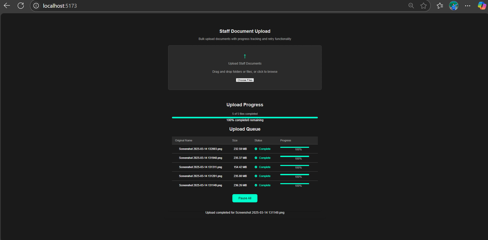

Staff Document Upload Tool
This project is a React-based web application built with TypeScript and Vite, designed for bulk uploading staff documents (e.g., PNG files) with a user-friendly interface. It supports drag-and-drop or file selection, limits uploads to 3 parallel operations, tracks progress, retries failed uploads, and displays upload status in a table.
Features

Drag-and-Drop Uploads: Upload multiple files by dragging and dropping or using a file picker.
Parallel Upload Limit: Processes up to 3 uploads concurrently for optimal performance.
Progress Tracking: Displays simulated upload progress (10% increments every 500ms) in a table.
Retry Logic: Automatically retries failed uploads (5xx errors) up to 2 times.
Accessible Interface: Includes an aria-live region for screen reader announcements of upload events.
Responsive Table: Shows file details (name, size, upload date, status, and progress) in a clear table format.

Setup

Clone the Repository:
git clone <repository-url>
cd staff-document-upload-tool

Install Dependencies:
npm install

Run the Development Server:
npm run dev

The application will be available at http://localhost:5173 (or another port if configured).

Build for Production:
npm run build

The output will be in the dist folder.

Dependencies

React: Frontend library for building the UI.
TypeScript: Adds static typing for improved code reliability.
Vite: Build tool with Hot Module Replacement (HMR) for fast development.
ESLint: Linting tool for code quality and consistency.

ESLint Configuration
To ensure code quality, the project uses ESLint with TypeScript and React-specific rules. To enable type-aware linting, update the ESLint configuration in eslint.config.js:
import tseslint from 'typescript-eslint';
import reactX from 'eslint-plugin-react-x';
import reactDom from 'eslint-plugin-react-dom';

export default tseslint.config([
  {
    ignores: ['dist'],
  },
  {
    files: ['**/*.{ts,tsx}'],
    extends: [
      ...tseslint.configs.recommendedTypeChecked,
      reactX.configs['recommended-typescript'],
      reactDom.configs.recommended,
    ],
    languageOptions: {
      parserOptions: {
        project: ['./tsconfig.node.json', './tsconfig.app.json'],
        tsconfigRootDir: import.meta.dirname,
      },
    },
  },
]);

Installing ESLint Plugins
To add React-specific lint rules, install the following plugins:
npm install eslint-plugin-react-x eslint-plugin-react-dom --save-dev

Running ESLint
Check for linting errors:
npm run lint

Fix linting issues automatically (where possible):
npm run lint -- --fix

Project Structure

src/
FileUpload.tsx: Main component handling file selection, uploads, and retry logic.
FileUploadTable.tsx: Component displaying the upload queue with progress and status.
FileUpload.css, FileUploadTable.css: Styles for the upload interface and table.

tsconfig.json, tsconfig.node.json: TypeScript configuration files.
vite.config.ts: Vite configuration for the build process.

Development Notes

API Endpoint: The application sends uploads to http://localhost:3000/api/documents. Ensure the backend server is running and configured to handle multipart/form-data requests.
Future Enhancements:
Replace simulated progress with real-time tracking using axios and onUploadProgress.
Add network-aware pausing using the Network Information API to pause uploads during poor connectivity.

Monitoring: Track the Upload Success Rate (successful_uploads / total_upload_attempts * 100) in a tool like Grafana to monitor performance.

